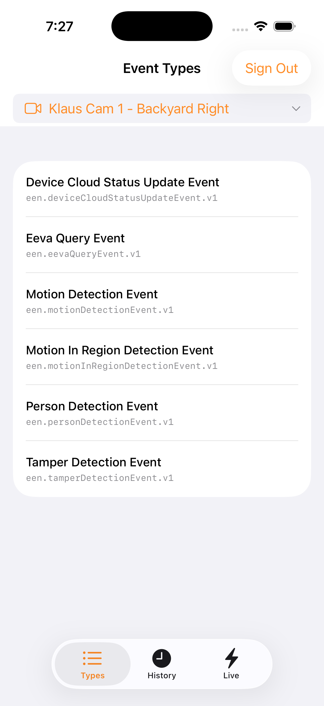

# SwiftEvents

A SwiftUI iOS app demonstrating event management and real-time SSE streaming features of the [EENApiToolkit](../../README.md) — the native Swift SDK for Eagle Eye Networks REST API v3.0.



## Features

- **OAuth Login** — Sign in via the EEN OAuth proxy
- **Camera Selection** — Shared camera picker across all tabs via `@Binding`
- **Event Types** — Lists all active event types for the selected camera using `listFieldValues`
- **Event History** — Loads recent historical events with adjustable time range (1-24 hours slider), sorted newest first
- **Live SSE Stream** — Real-time event feed via Server-Sent Events with Start/Stop control, connection status indicator, and event counter
- **Event Detail** — Tap any event (history or live) to view full JSON data in a modal, with copy-to-clipboard button

## Requirements

- iOS 16+
- Xcode 15+
- OAuth proxy (Cloudflare Workers by default, or local `http://127.0.0.1:3333`)

## Running

### On iPhone (default — uses Cloudflare proxy)

Open `SwiftEvents.xcodeproj` in Xcode, select your iPhone, and run. The app defaults to the Cloudflare proxy (`https://een-mobile-proxy.klaushofrichter.workers.dev`).

### On Simulator (local proxy)

1. Start the OAuth proxy:
   ```bash
   cd ../een-mobile-proxy/proxy && npm run dev
   ```

2. Build and run:
   ```bash
   xcodebuild -project SwiftEvents.xcodeproj -scheme SwiftEvents \
       -destination 'platform=iOS Simulator,name=iPhone 17 Pro' build
   ```

3. Sign in with your EEN credentials.

## Architecture

| File | Purpose |
|------|---------|
| `SwiftEventsApp.swift` | Entry point, credential injection for testing |
| `ContentView.swift` | Auth gate (login vs main UI) |
| `LoginView.swift` | OAuth sign-in screen |
| `OAuthWebView.swift` | WKWebView OAuth redirect capture |
| `MainTabView.swift` | Tab bar with Types, History, Live tabs; shared camera state |
| `CameraPickerView.swift` | Shared camera selection component (`@Binding` cameras) |
| `EventTypesView.swift` | Lists active event types for the selected camera |
| `EventHistoryView.swift` | Historical events with time range slider and Load button |
| `LiveEventsView.swift` | SSE subscription, real-time event feed with connection management |
| `EventDetailView.swift` | Modal JSON viewer with copy-to-clipboard |
| `Utilities.swift` | Shared formatting functions (`formatEENTimestamp`, `formatEventTime`) |
| `Config.swift` | Proxy URL and client configuration |

## EEN API Usage

| Feature | API Endpoint | Toolkit Method |
|---------|-------------|----------------|
| Event types per camera | `GET /events:listFieldValues` | `toolkit.events.listFieldValues(actor:)` |
| Event history | `GET /events` | `toolkit.events.list(params:)` |
| SSE subscription | `POST /eventSubscriptions` | `toolkit.eventSubscriptions.create(params:)` |
| SSE stream | SSE connection | `toolkit.eventSubscriptions.connect(sseUrl:options:)` |
| Delete subscription | `DELETE /eventSubscriptions/{id}` | `toolkit.eventSubscriptions.delete(id:)` |
| Camera list | `GET /cameras` | `toolkit.cameras.list(params:)` |

### Event History Query

The history view queries events with:
- `actor` — `camera:{cameraId}`
- `type__in` — all event types from `listFieldValues`
- `startTimestamp__gte` — configurable (1-24 hours ago)
- `startTimestamp__lte` — current time
- `sort` — `-startTimestamp` (newest first)
- `pageSize` — 50

### SSE Subscription

The live view creates a temporary SSE subscription filtered to the selected camera's event types, connects to the SSE URL, and inserts events at the top of the list (max 100). The subscription is deleted when disconnecting or switching cameras.

## Tests

### Unit Tests (2 tests)

Test utility functions:

```bash
xcodebuild test -project SwiftEvents.xcodeproj -scheme SwiftEvents \
  -destination 'platform=iOS Simulator,name=iPhone 17 Pro' \
  -only-testing:SwiftEventsTests
```

### E2E Tests (10 tests)

XCUITests verify the app's UI and API integration against a live EEN account:

- App launch, token injection, tab navigation
- Camera picker with camera list, auto-select, cross-tab persistence
- Event types list loading
- History tab controls and event loading
- Live tab SSE controls (toggle button, status label, event count)
- Sign out returns to login

```bash
# Run all E2E tests (requires proxy + credentials)
./run-ui-tests.sh
```

## Configuration

| Environment Variable | Default | Purpose |
|---------------------|---------|---------|
| `PROXY_URL` | `https://een-mobile-proxy.klaushofrichter.workers.dev` | OAuth proxy URL |
| `EEN_CLIENT_ID` | `PREVIEW-KLAUS-MOBILE` | EEN API client ID |
| `EEN_REDIRECT_URI` | `https://een-mobile-proxy.klaushofrichter.workers.dev` | OAuth redirect URI |
