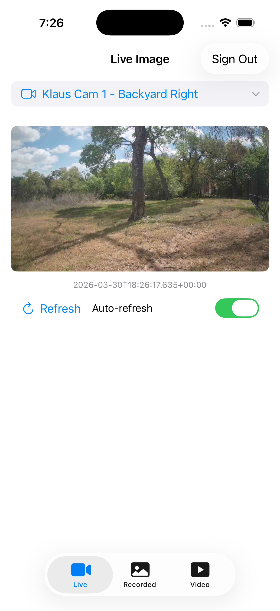

# SwiftMedia

A SwiftUI iOS app demonstrating live and recorded media features of the [EENApiToolkit](../../README.md) — the native Swift SDK for Eagle Eye Networks REST API v3.0.



## Features

- **OAuth Login** — Sign in via the EEN OAuth proxy, with app icon on login page
- **Camera Selection** — Shared camera picker across all tabs via `@Binding`
- **Live Image** — Auto-refreshing live preview image (5-second interval) with timestamp display and auto-refresh toggle
- **Recorded Image** — Time-based retrieval of preview and main (full resolution) images with previous/next navigation; "Image not available" fallback when recordings are missing
- **Recorded Video** — HLS video playback via AVPlayer with time selection, progress slider, and scrubbing
- **Shared Time Selector** — Selected date/time carries over between Recorded Image and Recorded Video tabs
- **App Icon** — Blue media playback themed icon

## Requirements

- iOS 16+
- Xcode 15+
- OAuth proxy (Cloudflare Workers by default, or local `http://127.0.0.1:3333`)

## Running

### On iPhone (default — uses Cloudflare proxy)

Open `SwiftMedia.xcodeproj` in Xcode, select your iPhone, and run. The app defaults to the Cloudflare proxy (`https://een-mobile-proxy.klaushofrichter.workers.dev`).

### On Simulator (local proxy)

1. Start the OAuth proxy:
   ```bash
   cd ../een-mobile-proxy/proxy && npm run dev
   ```

2. Build and run (the app reads `PROXY_URL` env var when set):
   ```bash
   xcodebuild -project SwiftMedia.xcodeproj -scheme SwiftMedia \
       -destination 'platform=iOS Simulator,name=iPhone 16 Pro' build
   ```

3. Sign in with your EEN credentials.

## Architecture

| File | Purpose |
|------|---------|
| `SwiftMediaApp.swift` | Entry point, credential injection for testing |
| `ContentView.swift` | Auth gate (login vs main UI) |
| `LoginView.swift` | OAuth sign-in screen with app icon |
| `OAuthWebView.swift` | WKWebView OAuth redirect capture |
| `MainTabView.swift` | Tab bar with Live, Recorded, Video tabs; shared camera and date state |
| `CameraPickerView.swift` | Shared camera selection component (`@Binding` cameras) |
| `LiveImageView.swift` | Live preview image with auto-refresh and timestamp |
| `RecordedImageView.swift` | Recorded images (preview + main) with time picker and "image not available" handling |
| `RecordedVideoView.swift` | HLS video playback with AVPlayer, progress slider, and scrubbing |
| `Utilities.swift` | Shared formatting functions (`formatEENTimestamp`, `formatDuration`) |
| `Config.swift` | Proxy URL and client configuration (Cloudflare default) |

## EEN API Usage

| Feature | API Endpoint | Toolkit Method |
|---------|-------------|----------------|
| Live image | `GET /media/liveImage.jpeg` | `toolkit.media.getLiveImage(params:)` |
| Recorded image | `GET /media/recordedImage.jpeg` | `toolkit.media.getRecordedImage(deviceId:params:)` |
| Media intervals | `GET /media` | `toolkit.media.listMedia(params:)` |
| HLS video | Feed `hlsUrl` via `GET /media` | `toolkit.media.listMedia(params:)` with `include: ["hlsUrl"]` |
| Media session | `POST /media/session` | `toolkit.media.initMediaSession(deviceId:)` |
| Camera list | `GET /cameras` | `toolkit.cameras.list(params:)` |

### HLS Video Playback

HLS streaming uses `AVURLAsset` with the `AVURLAssetHTTPHeaderFieldsKey` option to inject the Bearer token into all segment requests:

```swift
let headers = ["Authorization": "Bearer \(token)"]
let asset = AVURLAsset(url: hlsUrl, options: ["AVURLAssetHTTPHeaderFieldsKey": headers])
let player = AVPlayer(playerItem: AVPlayerItem(asset: asset))
```

### Recorded Image Navigation

Response headers from image endpoints provide pagination tokens:
- `X-Een-Timestamp` — Timestamp of the returned image
- `X-Een-NextToken` — Token for the next image
- `X-Een-PrevToken` — Token for the previous image

## Tests

### Unit Tests (15 tests)

Test utility functions and configuration without network access:

- `FormatDurationTests` — zero, seconds, minutes, hours, negative, infinity, NaN, fractional
- `FormatEENTimestampTests` — `+00:00` format, milliseconds, UTC timezone
- `AppConfigTests` — default proxy URL, client ID, redirect URI

```bash
xcodebuild test -project SwiftMedia.xcodeproj -scheme SwiftMedia \
  -destination 'platform=iOS Simulator,name=iPhone 16 Pro' \
  -only-testing:SwiftMediaTests
```

### E2E Tests (16 tests)

XCUITests verify the app's UI and API integration against a live EEN account:

- Login screen visibility, token injection, tab navigation
- Camera picker with camera list, selection label update, cross-tab persistence
- Live image loading, timestamp display, auto-refresh toggle
- Recorded image preview loading, Now button
- Video tab controls (Go, Play, Pause, Now buttons)
- Sign out returns to login

```bash
# Run all E2E tests (requires proxy + credentials)
./run-ui-tests.sh
```

## Configuration

| Environment Variable | Default | Purpose |
|---------------------|---------|---------|
| `PROXY_URL` | `https://een-mobile-proxy.klaushofrichter.workers.dev` | OAuth proxy URL |
| `EEN_CLIENT_ID` | `PREVIEW-KLAUS-MOBILE` | EEN API client ID |
| `EEN_REDIRECT_URI` | `https://een-mobile-proxy.klaushofrichter.workers.dev` | OAuth redirect URI |
