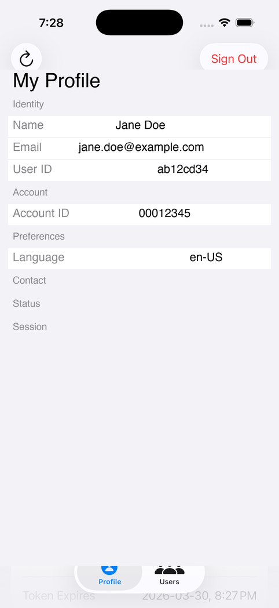

# SwiftUsers

A SwiftUI iOS app demonstrating user management features of the [EENSwiftToolkit](../../README.md) — the native Swift SDK for Eagle Eye Networks REST API v3.0.



## Features

- **OAuth Login** — Sign in via the EEN OAuth proxy
- **User Profile** — View authenticated user's detailed information (name, email, account ID, timezone, language, phone, permissions, status)
- **User List** — Browse all users in the account with pagination support
- **Session Management** — Keychain-based credential storage with auto-restore

## Requirements

- iOS 16+
- Xcode 15+
- OAuth proxy (Cloudflare Workers by default, or local `http://127.0.0.1:3333`)

## Running

### On iPhone (default — uses Cloudflare proxy)

Open `SwiftUsers.xcodeproj` in Xcode, select your iPhone, and run. The app defaults to the Cloudflare proxy (`https://een-mobile-proxy.klaushofrichter.workers.dev`).

### On Simulator (local proxy)

1. Start the OAuth proxy:
   ```bash
   cd ../een-mobile-proxy/proxy && npm run dev
   ```

2. Build and run:
   ```bash
   xcodebuild -project SwiftUsers.xcodeproj -scheme SwiftUsers \
       -destination 'platform=iOS Simulator,name=iPhone 17 Pro' build
   ```

3. Sign in with your EEN credentials.

## Architecture

| File | Purpose |
|------|---------|
| `SwiftUsersApp.swift` | Entry point, credential injection for testing |
| `ContentView.swift` | Auth gate and tab view controller |
| `LoginView.swift` | OAuth sign-in screen |
| `OAuthWebView.swift` | WKWebView OAuth redirect capture |
| `HomeView.swift` | Profile tab — displays current user details |
| `UsersListView.swift` | Users tab — paginated user list with status and last login |
| `Config.swift` | Proxy URL and client configuration |
| `Version.swift` | Auto-generated toolkit version |

## EEN API Usage

| Feature | API Endpoint | Toolkit Method |
|---------|-------------|----------------|
| Current user | `GET /users/self` | `toolkit.users.getCurrentUser()` |
| User list | `GET /users` | `toolkit.users.list(params:)` |
| OAuth login | Proxy endpoints | `toolkit.auth.getAuthUrl()`, `toolkit.auth.handleCallback(code:state:)` |
| Sign out | Token revocation | `toolkit.auth.revokeToken()` |

### User List Pagination

The users list fetches 20 users per page and supports loading more via `pageToken`. Each user entry shows name, email, active/inactive status, and last login date.

## Tests

### E2E Tests (5 tests)

XCUITests verify the app's UI and API integration against a live EEN account:

- App launch shows login screen
- Token injection shows Profile and Users tabs
- Profile tab displays user information
- Users tab loads and displays user list
- Pagination button behavior

```bash
# Run all E2E tests (requires proxy + credentials)
./run-ui-tests.sh
```

## Configuration

| Environment Variable | Default | Purpose |
|---------------------|---------|---------|
| `PROXY_URL` | `http://127.0.0.1:3333` | OAuth proxy URL |
| `EEN_CLIENT_ID` | `PREVIEW-KLAUS-MOBILE` | EEN API client ID |
| `EEN_REDIRECT_URI` | `http://127.0.0.1:3333` | OAuth redirect URI |
